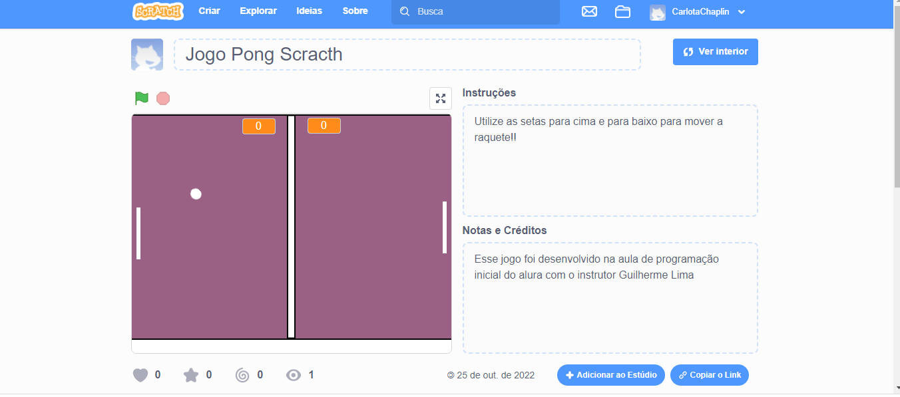

# Jogo-Pong-Scratch-

Esse jogo foi desenvolvido na aula de programação inicial do alura com o instrutor Guilherme Lima

Utilize as setas para cima e para baixo para mover a raquete!!

🕹 

🔗 [Clique aqui para jogar](https://scratch.mit.edu/projects/751007766)

